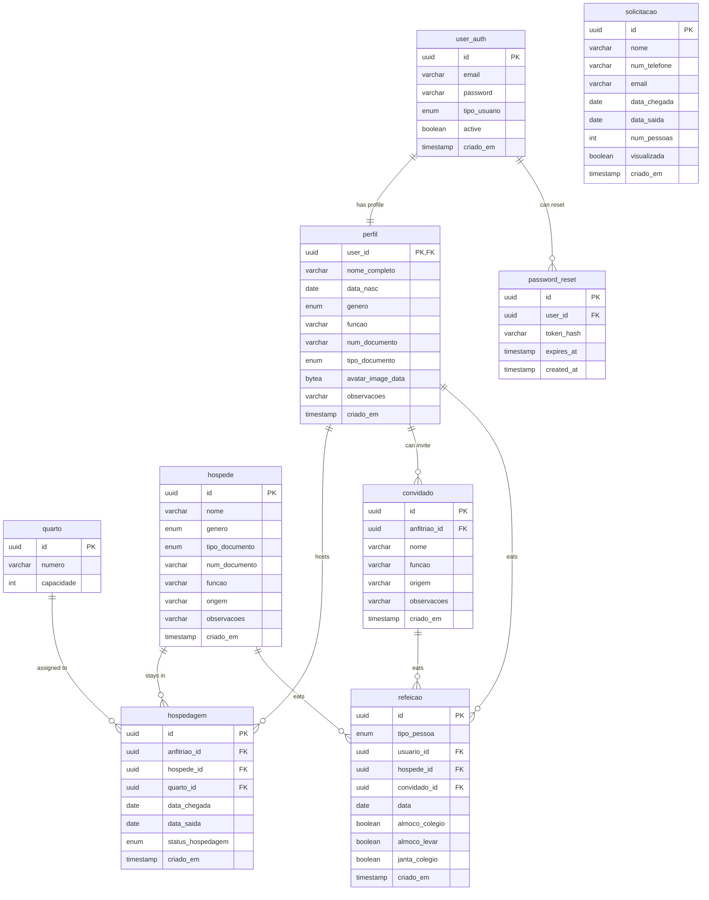

# Pio Brasileiro Backend

Node.js and Express backend with PostgreSQL database and JWT authentication.

## Features
- User registration and login with JWT tokens
- Bcrypt password hashing
- PostgreSQL with connection pooling
- JWT token validation middleware
- Image upload and storage in the database as Base64 binary files
- Role-based access control for protected routes (admin and common user)
- Integration with SMTP for sending transactional emails (verification, password reset)

## Database Schema
The database schema in a diagram for better visualization:



## Technologies (Requirements)
- Node.js (v16 or higher)
- PostgreSQL database
- Environment variables configured

## Installation

1. **Clone the repository**
   ```bash
   git clone <repository-url>
   cd piobrasileiro-backend
   ```

2. **Install dependencies**
   ```bash
   npm install
   ```

3. **Set up environment variables**
   
   Create a `.env` file in the root directory:
   ```env
   DB_USER=your_db_user
   DB_HOST=localhost
   DB_NAME=your_db_name
   DB_PASSWORD=your_db_password
   DB_PORT=5432
   JWT_SECRET=your_super_secret_jwt_key
   JWT_EXPIRES_IN=24h
   PORT=3000
   ```

4. **Set up the database**
   
   Run the SQL commands from `generate.sql` to create the required tables:
   ```bash
   psql your_db_name < generate.sql
   ```

## Running the Application

**Development mode** (with auto-reload):
```bash
npm run dev
```

**Production mode**:
```bash
npm start
```

The server will start on `http://localhost:3000` (or your configured PORT).

## API Endpoints

### Authentication Routes

| Method | Endpoint | Description | Body |
|--------|----------|-------------|------|
| `POST` | `/auth/register` | Register new user | `{ email, password }` |
| `POST` | `/auth/login` | Login user | `{ email, password }` |

### Example Requests

**Login User:**
```http
POST http://localhost:3000/auth/login
Content-Type: application/json

{
    "email": "user@example.com", 
    "password": "securepassword"
}
```

## Testing

Use the included `test.rest` file with REST Client extension in VS Code, or import into Postman/Insomnia.

## Project Structure

```
src/
├── controllers/
│   └── authController.js    # All the controllers for logic
├── middleware/
│   └── authMiddleware.js    # JWT token validation
├── routes/
│   └── authRoutes.js        # Route definitions for (admin, user, authentication)
├── db.js                    # Database connection for pooling
└── server.js                # Express app setup
```

## License

ISC License

## Author

Gabriel Fernandes Pereira
